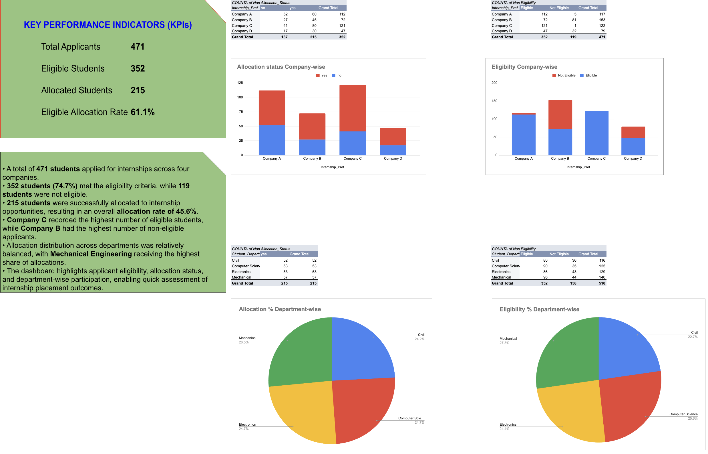

# Internship Allocation Dashboard | Microsoft Excel | Data Analytics Project

## Project Summary

Built an interactive Excel dashboard to analyze internship applications, eligibility, and allocation outcomes for 471 applicants across multiple departments and companies.

### Key Results

- Analyzed 471 internship applications
- Identified 352 eligible students
- Evaluated 215 successful allocations
- Calculated an overall allocation rate of 45.6%
- Developed KPI cards, Pivot Tables, and interactive visualizations for business reporting

## Tools Used

- Microsoft Excel
- Pivot Tables
- Pivot Charts
- VLOOKUP
- IF Functions
- Conditional Formatting
- Data Cleaning & Transformation

## Skills Demonstrated

- Data Cleaning
- Data Analysis
- Dashboard Development
- KPI Reporting
- Business Intelligence
- Data Visualization
- Excel Analytics

## Files

- Internship_Allocation_Dashboard.xlsx
- excel.png

## Author

Viraj Vinayak Prabhu
